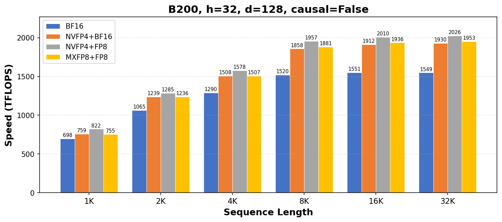
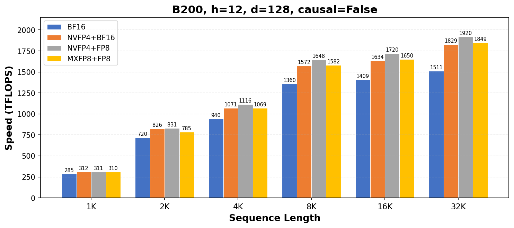
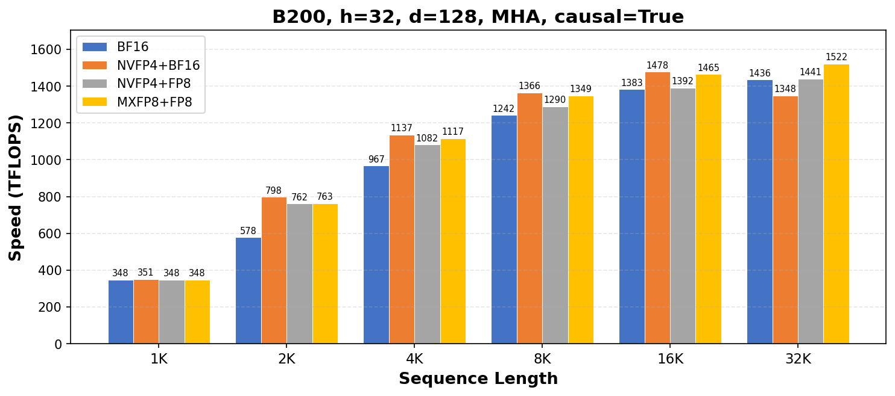
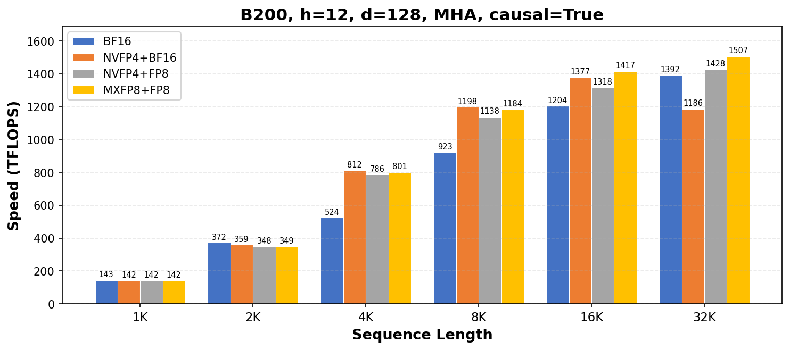
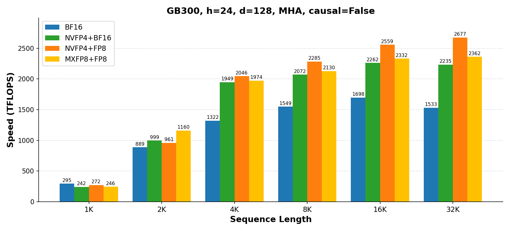
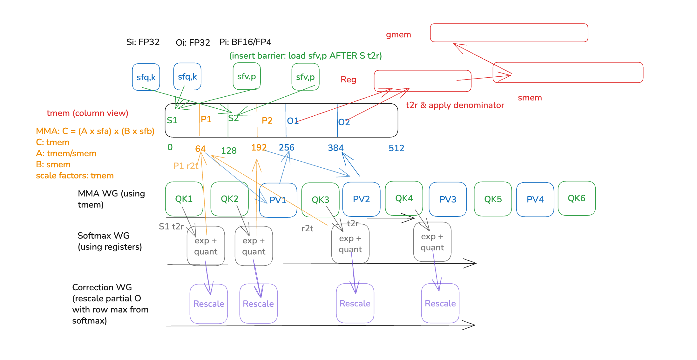

# FP4 Flash Attention 4 (FA4) on Blackwell

CuTe DSL implementation of FP4 block-scaled flash attention for NVIDIA Blackwell GPUs (sm100a/sm103a). Supports two modes:
- **QK quantization** (`--quant_qk`, default): Q and K quantized to NVFP4 E2M1 or MXFP8 E4M3 with block scale factors. V can be BF16 or FP8. Peaks at **2018 TFLOPS** (NVFP4+FP8) and **1948 TFLOPS** (MXFP8+FP8).
- **QKVP quantization** (`--quant_v`): additionally quantizes the softmax output P and V to NVFP4 with on-the-fly group-wise P quantization. Currently **slower than BF16** (0.84–0.95x) due to hardware limitations: the softmax exp (MUFU instruction) has the same throughput as on H100, but B200 MMA throughput doubles, making softmax warp the bottleneck (See [FA4 paper](https://arxiv.org/abs/2603.05451)). The added P quantization + scale factor R->SMEM->TMEM copy increases critical-path latency.
We speculate that on B300 and Rubin (w/ FP16 softmax) the QKVP quantization will be faster than BF16.

## Results — QK Quantization

Block-scaled QK attention with BF16 or FP8 PV (triton `do_bench`, B200):

| Config | NVFP4+BF16 | NVFP4+FP8 | MXFP8+FP8 | BF16 ref |
|--------|-----------|----------|----------|---------|
| b=1 s=256 h=16 d=128 | 34 | 39 | **40** | 35 |
| b=1 s=1024 h=16 d=128 | **418** | 416 | 414 | 380 |
| b=4 s=4096 h=16 d=128 | 1789 | **1875** | 1801 | 1479 |
| b=1 s=32768 h=16 d=128 | 1920 | **2016** | 1942 | 1543 |
| b=4 s=4096 h=32 d=128 | 1826 | **1920** | 1851 | 1471 |
| b=1 s=4096 h=12 d=128 | 1081 | **1118** | 1070 | 940 |
| b=1 s=32768 h=12 d=128 ¹ | 1823 | **1913** | 1846 | 1508 |
| b=1 s=4096 h=24 d=128 | 1482 | **1548** | 1480 | 1274 |
| b=1 s=32768 h=24 d=128 | 1887 | **2018** | 1948 | 1545 |
| b=1 s=32768 h=24 d=64 | 919 | **986** | — | 949 |

All values in TFLOPS. Peak: **NVFP4+FP8 2031 TF**, **MXFP8+FP8 1960 TF**.
**—** = unsupported. MXFP8 (sf_vec_size=32) requires headdim ≥ 128 because the block-scaled MMA hardware atom tiles 4 instruction K-tiles per scale factor, giving a minimum K dimension of `sf_vec_size × 4 = 128`. NVFP4 (sf_vec_size=16) supports headdim ≥ 64.

¹ Matches [Wan2.1-T2V-1.3B](https://huggingface.co/Wan-AI/Wan2.1-T2V-1.3B-Diffusers) inference (480×832 video, 81 frames → latent seqlen 32760, nheads=12, headdim=128).

### Sequence length sweep (B200, batch=1, dedicated GPU)






**h=32, d=128 (MHA)**

| Config | NVFP4+BF16 | NVFP4+FP8 | MXFP8+FP8 | BF16 ref | Speedup |
|--------|-----------|----------|----------|---------|---------|
| b=1 s=1024 h=32 d=128 | 759 | **822** | 755 | 698 | 1.18x |
| b=1 s=2048 h=32 d=128 | 1239 | **1285** | 1236 | 1065 | 1.21x |
| b=1 s=4096 h=32 d=128 | 1508 | **1578** | 1507 | 1290 | 1.22x |
| b=1 s=8192 h=32 d=128 | 1858 | **1957** | 1881 | 1520 | 1.29x |
| b=1 s=16384 h=32 d=128 | 1912 | **2010** | 1936 | 1551 | 1.30x |
| b=1 s=32768 h=32 d=128 | 1930 | **2026** | 1953 | 1549 | 1.31x |

**h=12, d=128 (MHA, Wan2.1 shapes)**

| Config | NVFP4+BF16 | NVFP4+FP8 | MXFP8+FP8 | BF16 ref | Speedup |
|--------|-----------|----------|----------|---------|---------|
| b=1 s=1024 h=12 d=128 | **312** | 311 | 310 | 285 | 1.09x |
| b=1 s=2048 h=12 d=128 | 826 | **831** | 785 | 720 | 1.15x |
| b=1 s=4096 h=12 d=128 | 1071 | **1116** | 1069 | 940 | 1.19x |
| b=1 s=8192 h=12 d=128 | 1572 | **1648** | 1582 | 1360 | 1.21x |
| b=1 s=16384 h=12 d=128 | 1634 | **1720** | 1650 | 1409 | 1.22x |
| b=1 s=32768 h=12 d=128 | 1829 | **1920** | 1849 | 1511 | 1.27x |

**GQA h=32, kv=8, d=128, causal=True**

| Config | NVFP4+BF16 | NVFP4+FP8 | MXFP8+FP8 | BF16 ref | Speedup |
|--------|-----------|----------|----------|---------|---------|
| b=1 s=1024 h=32 kv=8 d=128 | 349 | 348 | 348 | **379** | 0.92x |
| b=1 s=2048 h=32 kv=8 d=128 | **839** | 836 | 819 | 610 | 1.38x |
| b=1 s=4096 h=32 kv=8 d=128 | **1178** | 1127 | 1157 | 1017 | 1.16x |
| b=1 s=8192 h=32 kv=8 d=128 | **1398** | 1309 | 1369 | 1335 | 1.05x |
| b=1 s=16384 h=32 kv=8 d=128 | **1496** | 1406 | 1482 | 1486 | 1.01x |
| b=1 s=32768 h=32 kv=8 d=128 | **1537** | 1450 | 1533 | 1553 | 0.99x |

Per-call precision: cosine similarity ≥ 0.99 (block-scaled QK vs BF16 reference).

## Results — PV Quantization (GB300)

All block-scaled QK × PV combinations (triton `do_bench`, GB300) — includes the
SM103 ld.red row-max (incl. the BF16 ref), log-domain FP4 quant, the 3/4 FP8
P-split, MXFP8 PV, and the block-scaled-PV SF-stepping fix:

| Config | NVFP4+BF16 | NVFP4+FP8 | NVFP4+NVFP4 | NVFP4+MXFP8 | MXFP8+BF16 | MXFP8+FP8 | BF16 ref ² |
|--------|----|----|----|----|----|----|----|
| b=1 s=256 h=16 d=128 | 13 | 11 | 12 | 12 | 11 | 12 | **17** |
| b=1 s=1024 h=16 d=128 | 232 | 203 | 200 | 209 | 221 | 242 | **289** |
| b=4 s=4096 h=16 d=128 | 2227 | **2502** | 1524 | 1612 | 1849 | 2291 | 1508 |
| b=1 s=32768 h=16 d=128 | 2337 | **2666** | 1720 | 1807 | 2072 | 2383 | 1585 |
| b=4 s=4096 h=32 d=128 | 2196 | **2540** | 1544 | 1638 | 1879 | 2290 | 1475 |
| b=1 s=4096 h=12 d=128 | 1458 | **1458** | 942 | 987 | 1227 | 1418 | 1017 |
| b=1 s=32768 h=12 d=128 ¹ | 2276 | **2582** | 1646 | 1726 | 2021 | 2350 | 1584 |
| b=1 s=4096 h=24 d=128 | 1949 | **2046** | 1291 | 1360 | 1611 | 1974 | 1322 |
| b=1 s=32768 h=24 d=128 | 2235 | **2677** | 1725 | 1809 | 1974 | 2362 | 1533 |
| b=1 s=32768 h=24 d=64 | 1209 | 1203 | — | — | — | — | **1221** |

All values in TFLOPS (measured with a per-shape cooldown so no shape is
throttled by a hot predecessor — default-on in `bench_fp4`). Peak:
**NVFP4+FP8 2677 TF**, **MXFP8+FP8 2383 TF**, **NVFP4+BF16 2337 TF**,
**MXFP8+BF16 2072 TF**, **NVFP4+MXFP8 1809 TF**, **NVFP4+NVFP4 1725 TF**.
**—** = unsupported (d=64 needs head_dim ≥
sf_vec_size × 4: NVFP4 PV and MXFP8 require 128). Small shapes (s ≤ 1024) are
launch-latency dominated. MXFP8+x columns are MXFP8 QK (sf_vec 32, E8M0) with
BF16/plain-FP8 PV; NVFP4+MXFP8 is NVFP4 QK with MXFP8 PV (E4M3 P/V, E8M0 SFs
per 32) — slowest-but-most-accurate of the quantized-PV modes (mean_abs 0.0029
vs FP8 PV's 0.0040, FP4 PV's 0.0039).

¹ Matches [Wan2.1-T2V-1.3B](https://huggingface.co/Wan-AI/Wan2.1-T2V-1.3B-Diffusers) inference (480×832 video, 81 frames → latent seqlen 32760, nheads=12, headdim=128).

² **BF16 ref** is the non-block-scaled SM100 reference kernel
(`flash_fwd_sm100.py`), which also uses the SM103 ld.red fused S-load+row-max
(`FA4_LDRED_ROWMAX`, default-on) — every column includes it.

### Sequence-length sweep (GB300, h=24, d=128, non-causal)



## Results — QKV Quantization (quant_v)

Additionally quantizes softmax output P and V to FP4. The PV GEMM uses block-scaled MMA with on-the-fly P quantization (`scale_groupwise`) and SFP R2S copy. **Currently slower than BF16** because the softmax warp is the pipeline bottleneck — P quantization adds to the critical path.

| Config | FP4 QKV (ms) | BF16 (ms) | Speedup |
|--------|-------------|-----------|---------|
| b=1 s=256 h=16 d=128 | 0.028 | 0.039 | 1.42x ² |
| b=1 s=1024 h=16 d=128 | 0.027 | 0.041 | 1.52x ² |
| b=4 s=4096 h=16 d=128 | 1.287 | 1.217 | 0.95x |
| b=1 s=4096 h=12 d=128 | 0.435 | 0.336 | 0.77x |
| **b=1 s=32768 h=12 d=128** | **13.693** | **12.775** | **0.93x** |
| b=1 s=4096 h=24 d=128 | 0.538 | 0.486 | 0.90x |
| b=1 s=32768 h=24 d=128 | 27.053 | 22.617 | 0.84x |

² Small shapes are faster due to reduced memory traffic, but the slowdown at large shapes reflects the softmax bottleneck.

## Installation

### Editable Install

```bash
pip install -e .
```

### Fixing Editable Install Import Issues

If you have a non-editable `flash-attn` package installed, Python may import from the installed package instead of your local editable installation.

**Solution:** Run the fix script once after installation:

```bash
python fix_editable_import.py
```

**Verify it's working:**

```bash
python -c "import flash_attn.cute.interface; print(flash_attn.cute.interface.__file__)"
```

## Benchmarking

```bash
cd examples/python/CuTeDSL/blackwell/flash-attention/flash_attn/cute
CUTE_DSL_ENABLE_TVM_FFI=1 python benchmarks/bench_fp4.py --qk_mode nvfp4 --pv_mode bf16
CUTE_DSL_ENABLE_TVM_FFI=1 python benchmarks/bench_fp4.py --qk_mode nvfp4 --pv_mode fp8
CUTE_DSL_ENABLE_TVM_FFI=1 python benchmarks/bench_fp4.py --qk_mode mxfp8 --pv_mode fp8
```

## Precision (vs BF16 flash_attn_func reference)

Each cell: cos_sim / max_diff / mean_diff. NVFP4 uses flashinfer `nvfp4_quantize` (adaptive per-block SF). MXFP8 uses flashinfer `mxfp8_quantize` (per-group E8M0 SF). B200 sm_100a, cutlass-dsl 4.4.2. **—** = unsupported (MXFP8 / NVFP4 PV require headdim ≥ 128).

The first three columns are QK-quantized (BF16/FP8 PV). **NVFP4+NVFP4** and **NVFP4+MXFP8** are the QKVP modes that additionally quantize P/V (block-scaled PV GEMM): NVFP4 PV is E2M1 P/V with per-16 E4M3 SFs; MXFP8 PV is E4M3 P/V with per-32 E8M0 SFs. Both include the per-K-tile SF-stepping fix (before it, NVFP4 PV mean_diff was ~0.015 here). These two columns measured on GB300 sm_103a; the metrics are deterministic quantization math, so hardware-independent.

| Config (b,s,h,d) | NVFP4+BF16 | NVFP4+FP8 | MXFP8+FP8 | NVFP4+NVFP4 | NVFP4+MXFP8 |
|---|---|---|---|---|---|
| (1,256,16,128) | 0.9910 / 0.1562 / 0.0106 | 0.9904 / 0.1475 / 0.0109 | 0.9986 / 0.0605 / 0.0042 | 0.9817 / 0.1758 / 0.0152 | 0.9900 / 0.1680 / 0.0111 |
| (1,1024,16,128) | 0.9908 / 0.1846 / 0.0055 | 0.9901 / 0.2119 / 0.0057 | 0.9986 / 0.0459 / 0.0022 | 0.9818 / 0.1504 / 0.0078 | 0.9899 / 0.1025 / 0.0057 |
| (4,4096,16,128) | 0.9906 / 0.0445 / 0.0028 | 0.9899 / 0.0432 / 0.0029 | 0.9985 / 0.0215 / 0.0011 | 0.9820 / 0.0669 / 0.0039 | 0.9900 / 0.0522 / 0.0029 |
| (1,32768,16,128) | 0.9904 / 0.0112 / 0.0010 | 0.9897 / 0.0122 / 0.0010 | 0.9985 / 0.0057 / 0.0004 | 0.9816 / 0.0171 / 0.0014 | 0.9898 / 0.0151 / 0.0010 |
| (4,4096,32,128) | 0.9905 / 0.0605 / 0.0028 | 0.9898 / 0.0713 / 0.0029 | 0.9985 / 0.0225 / 0.0011 | 0.9818 / 0.0898 / 0.0039 | 0.9899 / 0.0938 / 0.0029 |
| (1,4096,12,128) | 0.9906 / 0.0674 / 0.0028 | 0.9899 / 0.0771 / 0.0029 | 0.9985 / 0.0146 / 0.0011 | 0.9810 / 0.0513 / 0.0039 | 0.9894 / 0.0469 / 0.0029 |
| (1,32768,12,128) | 0.9903 / 0.0175 / 0.0010 | 0.9896 / 0.0194 / 0.0010 | 0.9985 / 0.0042 / 0.0004 | 0.9812 / 0.0159 / 0.0014 | 0.9896 / 0.0150 / 0.0010 |
| (1,4096,24,128) | 0.9905 / 0.0586 / 0.0028 | 0.9898 / 0.0645 / 0.0029 | 0.9985 / 0.0215 / 0.0011 | 0.9812 / 0.0488 / 0.0039 | 0.9896 / 0.0522 / 0.0029 |
| (1,32768,24,128) | 0.9905 / 0.0115 / 0.0010 | 0.9899 / 0.0142 / 0.0010 | 0.9985 / 0.0046 / 0.0004 | 0.9817 / 0.0194 / 0.0014 | 0.9899 / 0.0154 / 0.0010 |
| (1,32768,24,64) | 0.9899 / 0.0215 / 0.0010 | 0.9892 / 0.0223 / 0.0011 | — | — | — |

Sequence-length sweep (cos_sim / max_diff / mean_diff). Same quantization as above (flashinfer `nvfp4_quantize` / `mxfp8_quantize`).

**h=32, d=128**

| Config (b,s,h,d) | NVFP4+BF16 | NVFP4+FP8 | MXFP8+FP8 | NVFP4+NVFP4 | NVFP4+MXFP8 |
|---|---|---|---|---|---|
| (1,1024,32,128) | 0.9905 / 0.0947 / 0.0055 | 0.9898 / 0.1064 / 0.0057 | 0.9985 / 0.0352 / 0.0022 | 0.9819 / 0.1250 / 0.0078 | 0.9900 / 0.1230 / 0.0057 |
| (1,2048,32,128) | 0.9905 / 0.0557 / 0.0039 | 0.9897 / 0.0796 / 0.0041 | 0.9985 / 0.0293 / 0.0016 | 0.9817 / 0.0742 / 0.0055 | 0.9899 / 0.0703 / 0.0041 |
| (1,4096,32,128) | 0.9904 / 0.0459 / 0.0028 | 0.9899 / 0.0552 / 0.0029 | 0.9985 / 0.0205 / 0.0011 | 0.9816 / 0.0596 / 0.0039 | 0.9898 / 0.0508 / 0.0029 |
| (1,8192,32,128) | 0.9905 / 0.0266 / 0.0020 | 0.9899 / 0.0493 / 0.0021 | 0.9985 / 0.0117 / 0.0008 | 0.9816 / 0.0361 / 0.0028 | 0.9898 / 0.0344 / 0.0021 |
| (1,16384,32,128) | 0.9905 / 0.0247 / 0.0014 | 0.9898 / 0.0244 / 0.0015 | 0.9985 / 0.0105 / 0.0006 | 0.9817 / 0.0278 / 0.0020 | 0.9898 / 0.0259 / 0.0015 |

**h=12, d=128**

| Config (b,s,h,d) | NVFP4+BF16 | NVFP4+FP8 | MXFP8+FP8 | NVFP4+NVFP4 | NVFP4+MXFP8 |
|---|---|---|---|---|---|
| (1,1024,12,128) | 0.9907 / 0.1113 / 0.0055 | 0.9900 / 0.0957 / 0.0057 | 0.9986 / 0.0342 / 0.0022 | 0.9818 / 0.0981 / 0.0078 | 0.9899 / 0.0830 / 0.0057 |
| (1,2048,12,128) | 0.9905 / 0.0518 / 0.0039 | 0.9899 / 0.0591 / 0.0041 | 0.9985 / 0.0234 / 0.0016 | 0.9814 / 0.0605 / 0.0055 | 0.9898 / 0.0596 / 0.0041 |
| (1,4096,12,128) | 0.9905 / 0.0579 / 0.0028 | 0.9899 / 0.0508 / 0.0029 | 0.9985 / 0.0156 / 0.0011 | 0.9810 / 0.0513 / 0.0039 | 0.9894 / 0.0469 / 0.0029 |
| (1,8192,12,128) | 0.9905 / 0.0420 / 0.0020 | 0.9898 / 0.0312 / 0.0021 | 0.9985 / 0.0127 / 0.0008 | 0.9811 / 0.0273 / 0.0028 | 0.9896 / 0.0273 / 0.0021 |
| (1,16384,12,128) | 0.9906 / 0.0154 / 0.0014 | 0.9899 / 0.0342 / 0.0015 | 0.9985 / 0.0063 / 0.0006 | 0.9821 / 0.0215 / 0.0020 | 0.9901 / 0.0205 / 0.0015 |
| (1,32768,12,128) | 0.9905 / 0.0115 / 0.0010 | 0.9898 / 0.0210 / 0.0010 | 0.9985 / 0.0044 / 0.0004 | 0.9812 / 0.0159 / 0.0014 | 0.9896 / 0.0150 / 0.0010 |

## Pipeline Graph (scale factor TMEM overlap schedule)


## Citation
If you find our FP4 kernel useful, please cite:
```
@misc{zhang2026attnqat4bitattentionquantizationaware,
      title={Attn-QAT: 4-Bit Attention With Quantization-Aware Training}, 
      author={Peiyuan Zhang and Matthew Noto and Wenxuan Tan and Chengquan Jiang and Will Lin and Wei Zhou and Hao Zhang},
      year={2026},
      eprint={2603.00040},
      archivePrefix={arXiv},
      primaryClass={cs.LG},
      url={https://arxiv.org/abs/2603.00040}, 
}
```